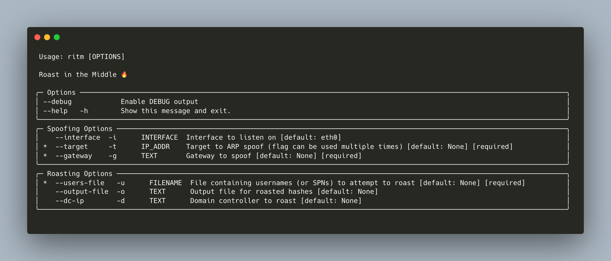
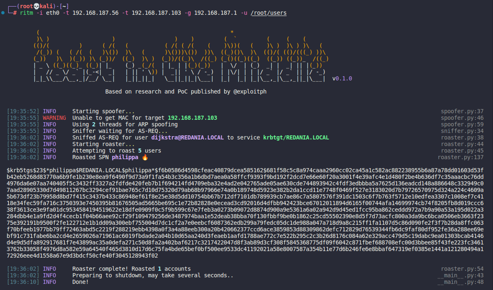

# RITM
This is a Python implementation of the man-in-the-middle attack described by Charlie Clark ([@exploitph](https://twitter.com/exploitph)) in his post, [New Attack Paths? AS Requested Service Tickets](https://www.semperis.com/blog/new-attack-paths-as-requested-sts/), and demonstrated in his proof-of-concept, [Roast in the Middle](https://github.com/0xe7/RoastInTheMiddle).

In short, this tool:
1. Performs ARP spoofing between your target(s) and the gateway to obtain a man-in-the-middle position
2. Sniffs traffic for an AS-REQ containing `PA-ENC-TIMESTAMP` data (yes, this will miss a valid AS-REQ where pre-auth is not required)
3. Replays the sniffed AS-REQ to a DC after changing the SPN to usernames/SPNs provided via a file
4. Outputs any roasted account hashes

For a greater level of technical detail I recommend reading Charlie's blog.

## Install
RITM can be installed by cloning this repository and running `pip3 install .` and subsequently executed from PATH with either `ritm` or `roastinthemiddle`

## Usage


## Example


I highly recommend specifying a domain controller to roast with `--dc-ip`

## Development
RITM uses Poetry to manage dependencies. Install from source and setup for development with:

```bash
git clone https://github.com/tw1sm/ritm
cd ritm
poetry install
poetry run ritm --help
```

## Credits
- Charlie Clark ([@exploitph](https://twitter.com/exploitph)) - This tool is completely based off his research and proof-of-concept code
- [Impacket](https://github.com/SecureAuthCorp/impacket) - for Kerberos structures and code to send/parse AS-REQs, AS-REPs